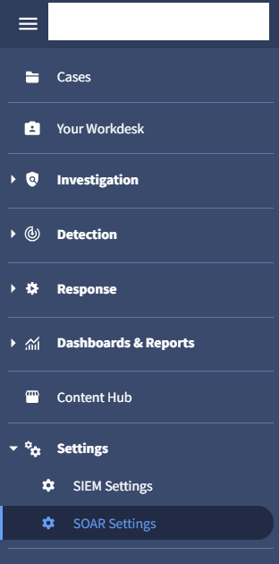
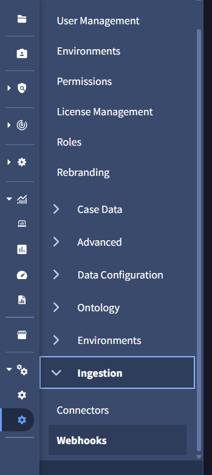
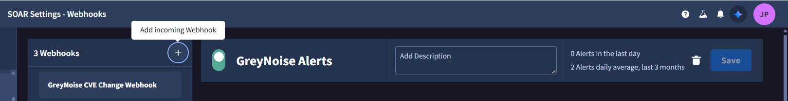
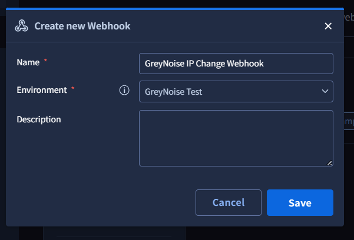
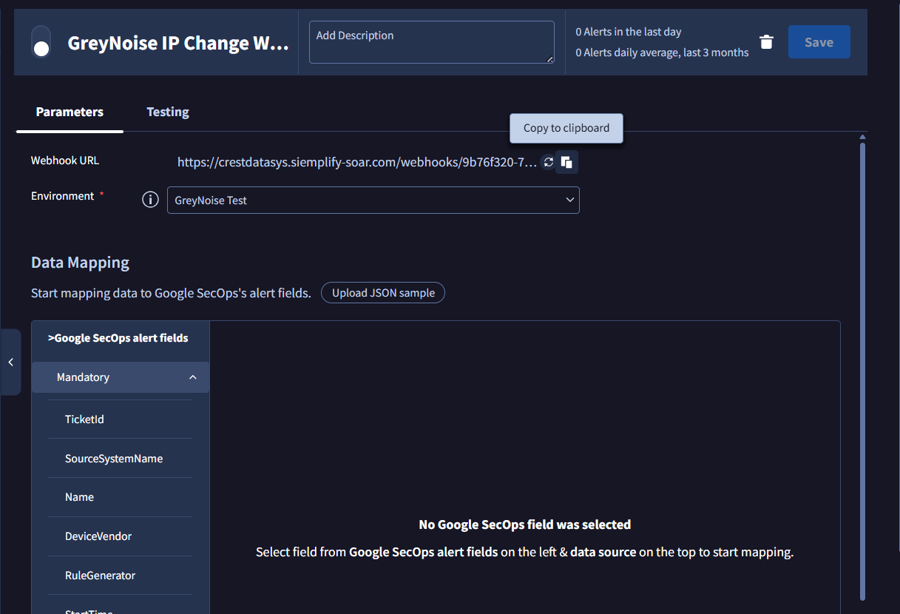
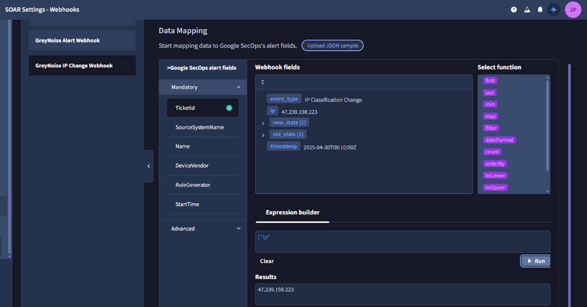

# GreyNoise Webhook Integration for Google SecOps SOAR

## Overview

The GreyNoise for Google SecOps SOAR Integration supports ingestion of **Alerts** and **Feeds** data via webhook delivery. Webhooks allow GreyNoise events to be delivered directly into Google SecOps SOAR for automated threat detection and response.

## Webhook Types

To ingest Alerts and Feed data, you need to create **3 webhooks** to support different schemas:

| Webhook Name | Purpose | Supported Schemas |
|--------------|---------|-------------------|
| **GreyNoise Alert Webhook** | Ingests all alert types | IP Alerts, CVE Alerts, TAG Alerts, GNQL Query Alerts |
| **GreyNoise IP Change Webhook** | Tracks IP classification changes | IP Classification Change Feed |
| **GreyNoise CVE Change Webhook** | Tracks CVE activity | CVE Spike Activity, CVE Status Change Feed |

> **Note:** Configure the webhooks relevant to your use case based on your requirements.

---

## Webhook Configuration

### Step 1: Access Google SecOps SOAR

1. Log in to the **Google SecOps SOAR UI** as an admin
2. Navigate to **SOAR Settings → Ingestion → Webhooks**




### Step 2: Add Incoming Webhook

1. Click **Add Incoming Webhook (+)**
2. Enter a **Name** for the webhook (e.g., `GreyNoise Alert Webhook`)
3. Choose the appropriate **Environment** where you want to ingest the alerts
4. Click **Save**




### Step 3: Generate Webhook URL

1. After saving, the platform will generate a **webhook URL**
2. **⚠️ Important:** Copy the webhook URL immediately — it cannot be retrieved again once you leave the page
3. You will need this URL for configuring your source in GreyNoise



### Step 4: Map the Alert Fields

1. In the **Data Mapping** section, click **Upload JSON sample**
2. Upload a representative webhook payload from your alert source (see [Supported Webhook Schemas](#supported-webhook-schemas) below)
3. Use the **Expression Builder** to map each field in SOAR to a JSON path or literal value
4. After mapping, use the **Run** button in the Expression Builder to preview output
5. Confirm proper mapping (green checkmark indicates success)



### Step 5: Enable the Webhook

1. Once all necessary fields are mapped, click **Save**
2. Click **Enable** to activate the webhook


### Step 6: Setup on GreyNoise

Follow the instructions from GreyNoise to set up Alerts and Feeds with the webhook URL you generated.

---

## Alerts Webhook

### Goal

Enable ingestion of GreyNoise Alert data into Google SecOps SOAR using webhooks.

### Field Mapping

| Field | Mapping Value | Value Type | Description |
|-------|---------------|------------|-------------|
| **TicketID** | `alert.id` | Dynamic | Unique identifier for the alert |
| **SourceSystemName** | `GreyNoise` | Static | Identifies the source system |
| **Name** | `alert.name` | Dynamic | Name of the alert |
| **DeviceVendor** | `GreyNoise` | Static | Vendor information |
| **RuleGenerator** | `GreyNoise-Alert` | Static | Static value for consistency |
| **StartTime** | `timestamp` | Dynamic | Time the alert was generated |
| **Reason** | `alert.creator` | Dynamic | Creator of the alert |
| **DeviceProduct** | `GreyNoise-Alert` | Static | Product information |
| **EndTime** | `timestamp` | Dynamic | Time the alert ended |
| **Priority** | `data.classification` | Dynamic | Classification of the alert |
| **EventsList** | `data \| first(1)` | Dynamic | List of events<br><br>**Note:** Here we are only considering the first record so it can be easily accessible in the playbook. |
| **EventProduct** | `GreyNoise` | Static | Product information |
| **EventName** | `alert.name` | Dynamic | Name of the event |

### Supported Webhook Schemas

#### 1. IP Alert

```json
{
    "alert": {
        "creator": "crest.phantom@crestdata.ai",
        "id": "3d19d419-c375-43fd-8f1a-996dcd463af7",
        "name": "IP Alert",
        "type": "ip"
    },
    "alert_link": "https://viz.greynoise.io/account/alerts?alert=3d19d419-c375-43fd-8f1a-996dcd463af7",
    "data": [
        {
            "classification": "suspicious",
            "ip": "176.236.29.137"
        }
    ],
    "query_link": "https://api.greynoise.io/v2/experimental/gnql?query=ip%3A%20176.236.29.137",
    "timestamp": "2025-07-31T19:01:15Z",
    "viz_link": "https://viz.greynoise.io/query/ip%3A%20176.236.29.137"
}
```

#### 2. CVE Alert

```json
{
    "alert": {
        "creator": "crest.phantom@crestdata.ai",
        "id": "78848d96-ee88-460b-841b-dd4d9c8ff613",
        "name": "CVE Alert",
        "type": "cve"
    },
    "alert_link": "https://viz.greynoise.io/account/alerts?alert=78848d96-ee88-460b-841b-dd4d9c8ff613",
    "data": [
        {
            "classification": "malicious",
            "ip": "220.247.174.202"
        }
    ],
    "query_link": "https://api.greynoise.io/v2/experimental/gnql?query=cve%3A%20CVE-2013-2134",
    "timestamp": "2025-07-31T19:01:13Z",
    "viz_link": "https://viz.greynoise.io/query/cve%3A%20CVE-2013-2134"
}
```

#### 3. TAG Alert

```json
{
    "alert": {
        "creator": "crest.phantom@crestdata.ai",
        "id": "43b6990e-01b7-468c-afae-0015e3d77095",
        "name": "SIP REGISTER Scanner",
        "type": "tag"
    },
    "alert_link": "https://viz.greynoise.io/account/alerts?alert=43b6990e-01b7-468c-afae-0015e3d77095",
    "data": [
        {
            "classification": "malicious",
            "ip": "168.100.239.215"
        }
    ],
    "query_link": "https://api.greynoise.io/v2/experimental/gnql?query=tags%3A%20SIP%20REGISTER%20Scanner",
    "timestamp": "2025-08-06T21:01:25Z",
    "viz_link": "https://viz.greynoise.io/query/tags%3A%20SIP%20REGISTER%20Scanner"
}
```

#### 4. GNQL Query Alert

```json
{
    "alert": {
        "creator": "crest.phantom@crestdata.ai",
        "id": "0ed61042-6859-4dd7-9ede-cd373d0d7df5",
        "name": "GNQL Alert",
        "type": "query"
    },
    "alert_link": "https://viz.greynoise.io/account/alerts?alert=0ed61042-6859-4dd7-9ede-cd373d0d7df5",
    "data": [
        {
            "classification": "malicious",
            "ip": "216.73.216.124"
        }
    ],
    "query_link": "https://api.greynoise.io/v2/experimental/gnql?query=last_seen%3A1d%20classification%3Amalicious%20bot%3Atrue",
    "timestamp": "2025-07-31T19:01:12Z",
    "viz_link": "https://viz.greynoise.io/query/last_seen%3A1d%20classification%3Amalicious%20bot%3Atrue"
}
```

---

## Feeds Webhook

### Goal

Enable ingestion of GreyNoise feed data (IPs and CVEs) into Google SecOps SOAR to track observable state changes over time and trigger appropriate playbooks based on updates.

> **Note:** You need to create **two separate webhooks**:
> 1. **IP Classification Change Webhook**
> 2. **CVE Change Webhook** (for CVE Spike Activity and CVE Status Change)

---

### Webhook 1: CVE Status Change and CVE Activity Spike

#### Field Mapping

| Field | Mapping Value | Value Type | Description |
|-------|---------------|------------|-------------|
| **TicketID** | `cve` | Dynamic | Unique identifier for the CVE event |
| **SourceSystemName** | `GreyNoise` | Static | Identifies the source system |
| **Name** | `event_type` | Dynamic | Type of CVE event |
| **DeviceVendor** | `GreyNoise` | Static | Vendor information |
| **RuleGenerator** | `GreyNoise-Feed` | Static | Static value for consistency |
| **StartTime** | `timestamp` | Dynamic | Time the event was generated |
| **DeviceProduct** | `GreyNoise-Feed` | Static | Product information |
| **EndTime** | `timestamp` | Dynamic | Time the event ended |
| **EventsList** | `first(1)` | Dynamic | List of events |
| **EventProduct** | `GreyNoise` | Static | Product information |
| **EventName** | `event_type` | Dynamic | Name of the event |

#### Supported Schemas

##### CVE Status Change

```json
{
    "cve": "CVE-2022-31718",
    "event_type": "cve-status-change",
    "metadata": {},
    "new_state": {
        "activity_seen": false,
        "benign_ip_count_10d": 0,
        "benign_ip_count_1d": 0,
        "benign_ip_count_30d": 0,
        "threat_ip_count_10d": 1,
        "threat_ip_count_1d": 1,
        "threat_ip_count_30d": 1
    },
    "old_state": {
        "activity_seen": true,
        "benign_ip_count_10d": 0,
        "benign_ip_count_1d": 0,
        "benign_ip_count_30d": 0,
        "threat_ip_count_10d": 0,
        "threat_ip_count_1d": 0,
        "threat_ip_count_30d": 0
    },
    "timestamp": "2025-08-11T10:30:16.972504375Z"
}
```

##### CVE Activity Spike

```json
{
    "ip": "47.239.198.223",
    "tag": "Palo Alto Networks Login Scanner",
    "event_type": "New IP Activity",
    "event": "added",
    "timestamp": "2025-04-30T08:10:00Z"
}
```

---

### Webhook 2: IP Classification Change

#### Field Mapping

| Field | Mapping Value | Value Type | Description |
|-------|---------------|------------|-------------|
| **TicketID** | `ip` | Dynamic | Unique identifier for the IP event |
| **SourceSystemName** | `GreyNoise` | Static | Identifies the source system |
| **Name** | `event_type` | Dynamic | Type of IP event |
| **DeviceVendor** | `GreyNoise` | Static | Vendor information |
| **RuleGenerator** | `GreyNoise-Feed` | Static | Static value for consistency |
| **StartTime** | `timestamp` | Dynamic | Time the event was generated |
| **DeviceProduct** | `GreyNoise-Feed` | Static | Product information |
| **EndTime** | `timestamp` | Dynamic | Time the event ended |
| **Priority** | `new_state.classification` | Dynamic | New classification state |
| **EventsList** | `first(1)` | Dynamic | List of events |
| **EventProduct** | `GreyNoise` | Static | Product information |
| **EventName** | `event_type` | Dynamic | Name of the event |

#### Supported Schema

```json
{
    "event_type": "ip-classification-change",
    "ip": "86.57.2.53",
    "new_state": {"classification": "malicious"},
    "old_state": "unknown",
    "timestamp": "2025-08-11T10:42:39Z",
    "workspace_id": "e4a5be2e-1be0-4105-a5e2-51e6a5525fa0"
}
```

---

## Limitations

- Currently we have temporarily mapped Alert Priority to the classification field for webhooks, even though Priority is an enum field and the direct mapping will not produce the expected results. The webhook expression builder in Google SecOps does not support nested if-else logic for mapping multiple classification values to priority levels (e.g., mapping "malicious → CRITICAL", "suspicious → HIGH", etc.), as discussed in the [community](https://security.googlecloudcommunity.com/google-security-operations-2/how-to-map-the-payload-field-to-the-soar-webhook-fields-in-google-secops-soar-severity-mapping-nested-ifelse-and-storing-full-json-6284). This limitation means priority determination must be handled via playbooks until more flexible mapping is supported in webhook.

---

## References

For additional assistance with GreyNoise webhook configuration, please refer to:
- [GreyNoise Documentation](https://docs.greynoise.io/)
- [Google SecOps SOAR Webhook Documentation](https://docs.cloud.google.com/chronicle/docs/soar/ingest/webhooks/setting-up-a-webhook)

---